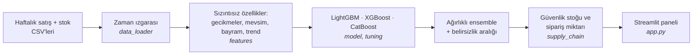
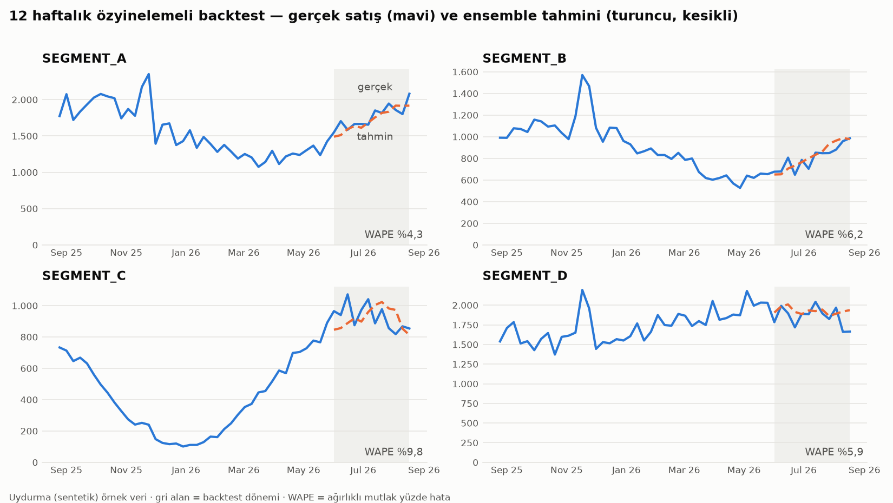
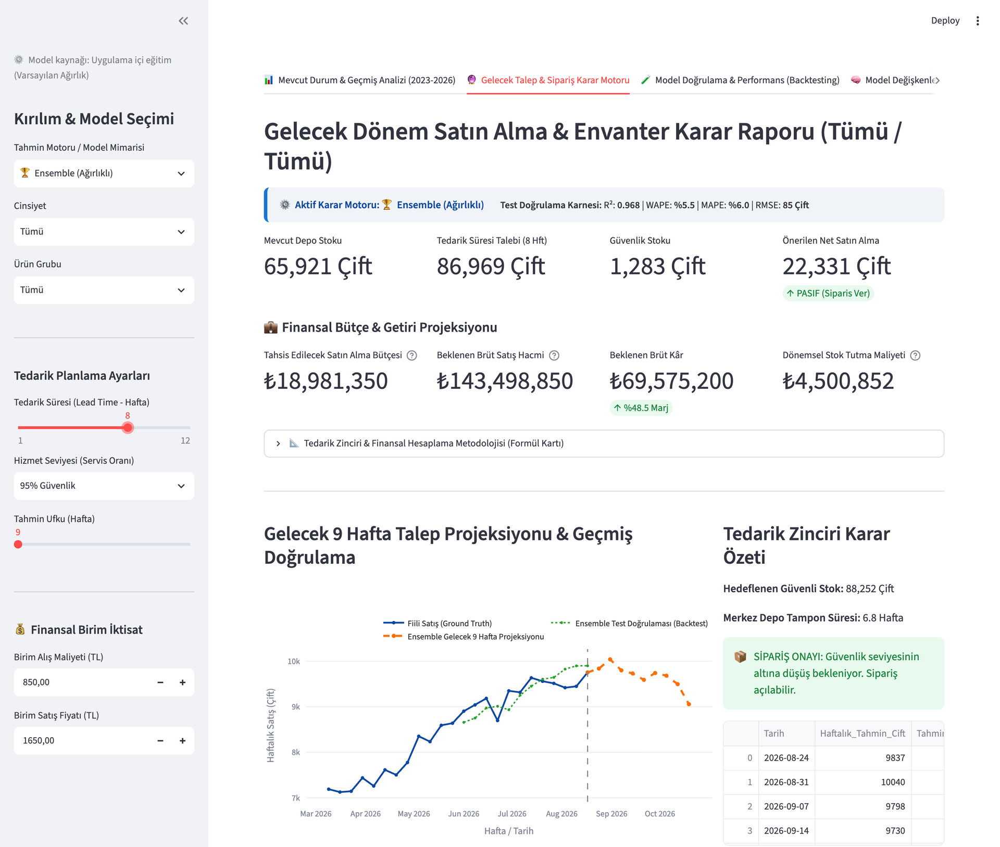

# Retail Demand Forecast

**Haftalık satış tahminini, sipariş kararına çeviren uçtan uca bir sistem.**

Perakendede iki hata da pahalıdır: stok az olursa satış kaçar, fazla olursa
sermaye rafta bekler. Bu proje, bir ayakkabı perakendecisinin kadın/erkek satış
ve stok verisinden gelecek haftaların satışını tahmin eder ve bu tahmini
güvenlik stoğu ile sipariş miktarı önerisine çevirir. Sonuçlar bir Streamlit
panelinde sunulur.



> **Veri gizliliği:** Proje gerçek perakende verisiyle geliştirildi; veri,
> eğitilmiş modeller ve ham çıktılar gizlilik gereği bu depoda **yoktur**.
> Depodaki `sample_data/` tamamen **uydurma** (sentetik) veridir ve gerçek
> verinin formatını taklit eder; sadece kodu çalıştırıp denemek içindir.
> Aşağıdaki performans rakamları gerçek veri üzerinde ölçülmüştür, örnek
> veriyle yeniden üretilemez.

## English summary

**Retail Demand Forecast** is an end-to-end system that turns weekly sales
forecasts into purchase-order decisions for a footwear retailer.

- **Forecasting:** weekly demand per gender × product-category series with a
  LightGBM / XGBoost / CatBoost ensemble (weights tuned with Optuna and
  rolling-origin cross-validation) plus quantile models for prediction intervals.
- **Leakage-safe features:** lags, seasonality, religious and retail holidays,
  trend. Automated tests guard against target leakage.
- **Inventory decision:** forecasts are converted into safety stock, target
  stock and order quantity, and served in a Streamlit dashboard.
- **Honest evaluation:** WAPE of **22.9% ± 4.5** across 4 rolling-origin folds on
  the real data. An earlier single-window result looked far better (1–3%)
  because of target leakage, which was found and fixed.
- **Data privacy:** the real data and trained models are private and not in this
  repository. It ships **synthetic sample data**, so everything runs out of the
  box (commands in the quick-start section below).

## Öne çıkanlar

- **Dürüst performans:** rolling-origin CV ile ölçülen WAPE **%22,9**
  (4 farklı dönem ortalaması, R² 0,84) — tek pencereye değil, dönemsel
  tutarlılığa göre doğrulanmış.
- **Veri sızıntısına karşı titizlik:** geliştirme sürecinde 3 özelliğin aynı
  haftanın satışını sızdırdığı bulundu ve temizlendi (WAPE yapay olarak %1–3
  görünüyordu); sızıntıyı yakalayan otomatik testler eklendi.
- **3 model + 2 dış sinyal:** LightGBM/XGBoost/CatBoost ensemble'ı,
  ağırlıkları Optuna + rolling-origin CV ile optimize edilmiş; Prophet ve
  PatchTST'nin sızıntısız walk-forward tahminleri ek feature olarak girebiliyor
  (opsiyonel).
- **Uçtan uca envanter kararı:** talep tahmininden (kantil modellerle
  belirsizlik dahil) güvenlik stoku, hedef stok ve sipariş miktarına.
- **Sağlamlık:** 19 otomatik test (sızıntı, feature seti, ağırlık toplamı,
  sipariş kararı, CV altyapısı). Bu depoyu indirdiğinde 13'ü çalışır; kalan 6'sı
  gizli veriyle eğitilmiş modelleri kontrol ettiği için `models/` yokken atlanır.

## Örnek çıktı



*Yukarıdaki grafik `sample_data/` içindeki uydurma veriyle, bu depodaki kodla
üretildi (`scripts/make_readme_figure.py`). Uydurma veri düzenli ve gürültüsü
düşük olduğu için buradaki WAPE değerleri (%4–10), gerçek perakende verisinde
ölçülen %22,9'dan düşüktür; amaç sonuç iddiası değil, panelin/pipeline'ın
çıktısını göstermektir.*

### Streamlit paneli



*Panelin "Gelecek Talep & Sipariş Karar Motoru" sekmesi (tedarik süresi 8
hafta), yine uydurma örnek veriyle çalışıyor. Ekrandaki adetler ve para
tutarları sentetik veriden ve panelin varsayılan birim maliyet/fiyat
girdilerinden hesaplanan örnek değerlerdir; gerçek bir şirkete ait değildir.*

## Hızlı başlangıç (örnek veriyle)

```bash
python -m venv .venv && source .venv/bin/activate
pip install -r requirements.txt       # çekirdek paketler (birkaç dakika)

python main.py                    # veri → feature → ensemble eğitimi → backtest (örnek veriyle birkaç saniye)
pytest tests/ -v                  # otomatik testler
streamlit run app.py              # panel: http://localhost:8501
```

Python 3.14 ile test edildi. Ağır opsiyonel paketler (Prophet, PatchTST, notebook)
örnek veri için gerekmez; istersen `pip install -r requirements-extra.txt`.

`data/` klasörü yoksa kod otomatik olarak `sample_data/` içindeki uydurma
veriyi kullanır (ekrana uyarı basar). Örnek veriyi yeniden üretmek için:
`python scripts/generate_sample_data.py`.

Kendi verinle çalışmak için aynı formatta dört CSV'yi (`kadin_satis.csv`,
`erkek_satis.csv`, `kadin_stok.csv`, `erkek_stok.csv`; `;` ayraçlı) `data/`
altına koy — `sample_data/` formatına bakman yeterli.

Veri setine özgü kategori adları kodda sabit değildir: `src/config.py`
yer tutucularla gelir, gerçek değerleri proje kökündeki (git'e girmeyen)
`local_config.json` ile verirsin.

Modeli sıfırdan CV ile eğitmek için:

```python
from src.data_loader import load_and_preprocess_data
from src.features import build_features
from src.tuning import run_cv_tuning, rolling_origin_cv, stress_test

df = build_features(load_and_preprocess_data())
run_cv_tuning(df, n_trials=40, n_folds=3)   # models/ klasörünü yazar
rolling_origin_cv(df, n_folds=4)             # models/cv_results.json
stress_test(df)                              # models/stress_test.json
```

## Proje yapısı

```
app.py              Streamlit paneli (asıl arayüz)
main.py             Basit CLI eğitim girişi (panel olmadan hızlı kontrol)
src/
  config.py           Veri setine özgü ayarlar (kategori adları yer tutucu, yerelden okunur)
  data_loader.py      CSV'leri okur, haftalık zaman ızgarasını kurar
  features.py         Ham veriden model özellikleri üretir, veri sızıntısını temizler
  model.py            LightGBM/XGBoost/CatBoost eğitimi + recursive backtest
  supply_chain.py     Geleceğe tahmin üretimi + sipariş/güvenlik stoğu formülleri
  tuning.py           Optuna hiperparametre + ensemble ağırlık optimizasyonu, CV, stres testi
  aux_forecasters.py  Prophet/PatchTST'nin sızıntısız walk-forward tahminlerini üretir (opsiyonel feature)
scripts/
  generate_sample_data.py   Gerçek formatta uydurma örnek veri üretir
  make_readme_figure.py     README'deki örnek backtest grafiğini üretir (yalnızca sample_data ile)
assets/             README görseli
sample_data/        Uydurma örnek veri (sentetik)
tests/              Otomatik sağlamlık testleri
```

## WAPE nedir, neden üç farklı ölçüm var?

WAPE (ağırlıklı mutlak yüzde hata) = toplam mutlak hata / toplam gerçek satış.
Projede üç farklı ölçüm türü kullanıldı; birbirinin yerine kullanılmamalı:

| Ölçüm | Nasıl ölçüldü |
|---|---|
| **Direct (tek adım)** | %15'lik TEST diliminde — her hafta için gerçek geçmiş lag'ler modele verilir (en iyimser) |
| **Recursive (çok adım)** | Son 12 haftada — model kendi tahminini bir sonraki haftanın lag'i olarak kullanır (gerçek kullanıma yakın) |
| **Rolling-origin CV** | Recursive, 4 farklı dönemde — **dönemsel tutarlılık için en güvenilir özet (%22,9 ± %4,5)** |

Direct ölçüm her zaman daha iyi görünür (model her hafta gerçek geçmişe geri
"demirlenir"). Dışarıya rapor verirken CV ortalaması ya da recursive backtest
kullanılmalı. Tek bir doğrulama penceresine bakarak "bu yöntem daha iyi" demek
bu projede defalarca yanıltıcı çıktı; kararlar çok-fold rolling-origin CV ile verildi.
